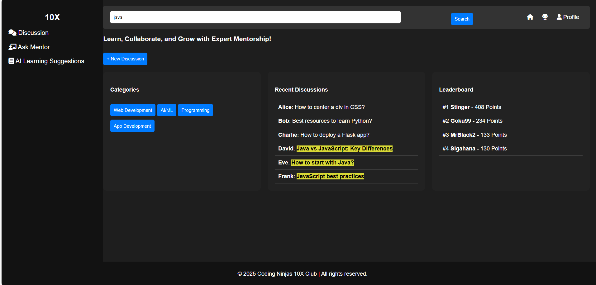
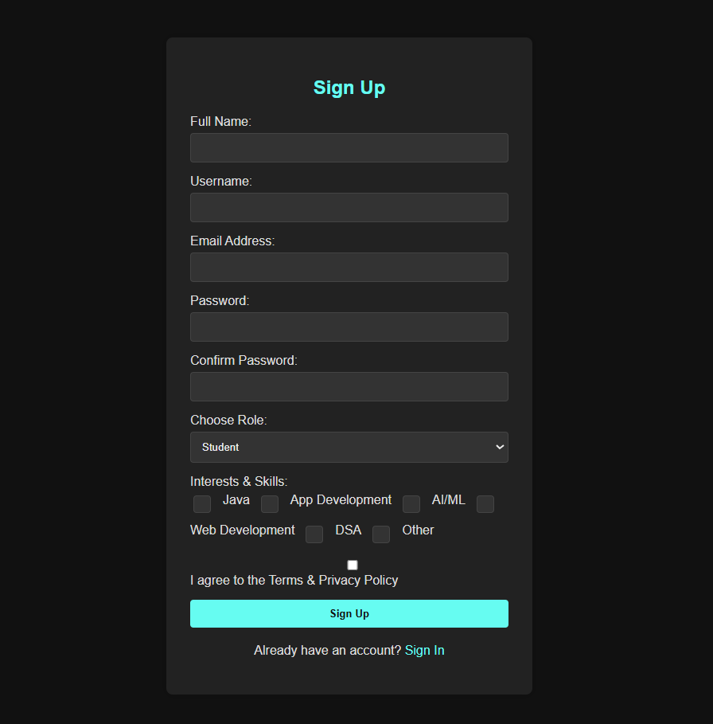
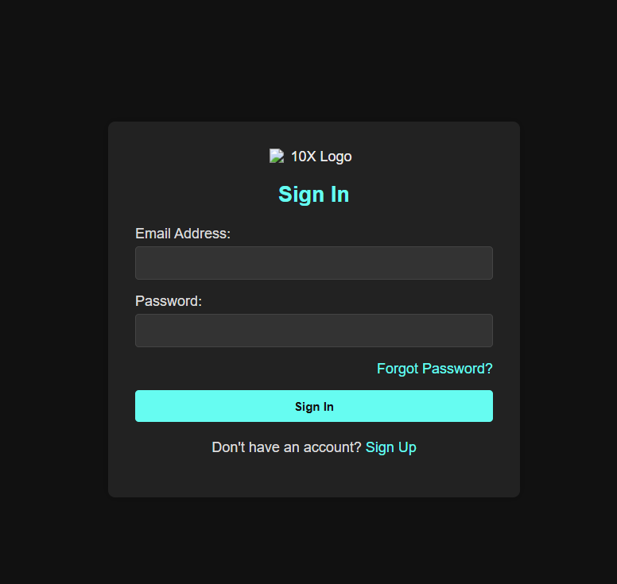
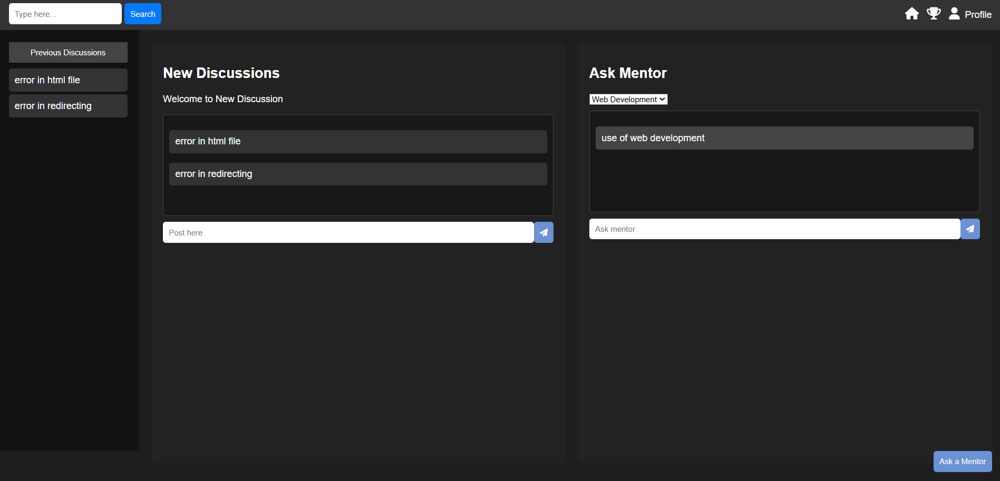

# Interactive & Scalable Discussion Forum for 10x Club  

A centralized, AI-powered platform for structured coding discussions, mentorship, and collaboration.  

## 🎥 UI Demo Video

[Watch the UI Demo Video]([https://drive.google.com/file/d/12KUOJLqX8TyvHyFzhcpf9JgSxf4TQ8Gg/view?usp=drive_link])

## Screenshots

### Dashboard Page

### SignUp Page

### SignIn Page

### Discussion Page

### New Discussion & Ask Mentor Page

## 🔍 Problem Overview  
Students often face unorganized coding discussions across multiple platforms (WhatsApp, Discord, LinkedIn), making mentorship and collaboration difficult. This forum provides a structured, interactive space for seamless learning and engagement.  

## 🚀 Challenges to Address  
- How to create topic-based discussions for structured learning?  
- How can active participation and contribution be encouraged?  
- How can AI improve searchability and discussion relevance?  
- How can a mentor support system for expert guidance be integrated?  
- How to ensure quality discussions while preventing spam?  

## 🛠 Expected Features & Outcomes  
✅ **Real-time Discussions** – Topic-based threads & Q&A.  
✅ **AI-Powered Search** – Suggests relevant discussions & solutions.  
✅ **Gamification System** – Leaderboards, badges, and upvotes for engagement.  
✅ **Code Snippet Sharing** – Seamless coding discussions.  
✅ **"Ask a Mentor" Feature** – Direct guidance from experts.  
✅ **Automated Moderation** – Spam filtering & quality maintenance.  

## 🌍 Impact & Relevance  
📌 Provides quick, reliable answers to coding queries.  
📌 Fosters peer learning and mentorship access.  
📌 Builds a collaborative community within the 10x Club.  

